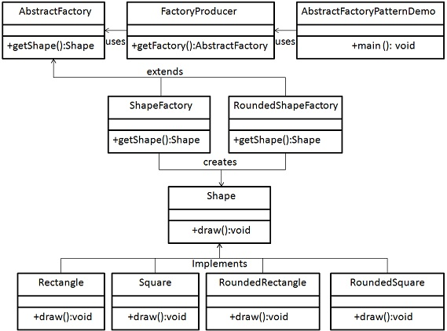

# Abstract Factory Method

The Abstract Factory Method pattern - creational design pattern that provides an interface for creating related or dependent objects without specifying their concrete classes. The goal of the Abstract Factory pattern is to abstract the process of object creation and allow clients to use the same code to work with different object families.
The Abstract Factory pattern is often used in complex systems where there are multiple families of objects that are related or dependent on each other. By using an Abstract Factory, the system can be decoupled from the specific implementations of the objects and can be more easily maintained and extended.

The Abstract Factory pattern consists of four main components:
1. *Abstract Factory*: This is an interface or abstract class that defines the methods for creating the related objects.
2. *Concrete Factory*: This is a class that implements the Abstract Factory and creates the concrete objects.
3. *Abstract Product*: This is an interface or abstract class that defines the methods that the concrete products must implement.
4. *Concrete Product*: This is a class that implements the Abstract Product and provides a specific implementation for the methods.

## Implementation -
The Abstract Factory pattern is often implemented using inheritance or composition. In the inheritance approach, each family of related objects is defined by a separate concrete factory class that implements the abstract factory interface. In the composition approach, the concrete factories are implemented as separate classes and are injected into the client class.

Overall, the Abstract Factory pattern is a powerful tool for creating modular and flexible code that can be easily maintained and extended. It allows the system to be decoupled from the specific implementations of the objects, and provides a level of abstraction that makes the code more flexible and reusable.