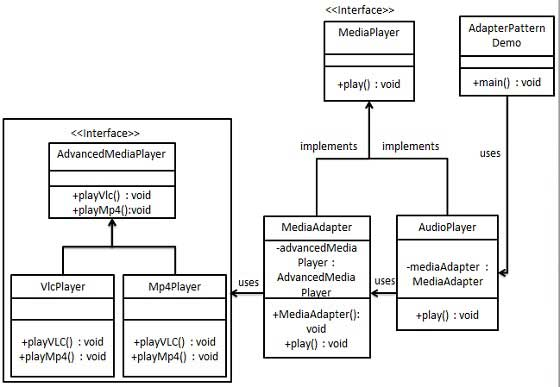

# Adapter Pattern

The Adapter Pattern is a design pattern that allows two incompatible interfaces to work together. It is often used when you want to use a class that cannot be modified or when you want to reuse a class that already exists but does not have the interface you need. In this pattern, an adapter class is created that translates the interface of one class into another interface that clients expect.

This pattern involves a single class which is responsible to join functionalities of independent or incompatible interfaces. A real life example could be a case of card reader which acts as an adapter between memory card and a laptop. You plugin the memory card into card reader and card reader into the laptop so that memory card can be read via laptop.

## Implementation -
1. Java -
    1. Create interfaces.
    2. Create concrete classes implementing the interface.
    3. Create adapter class implementing the interface.