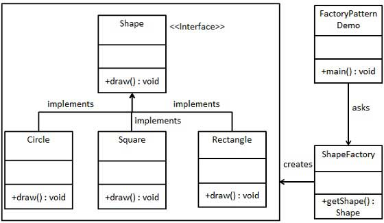

# Factory Method
---

The Factory Method pattern - A creational design pattern that provides an interface for creating objects, but allows subclasses to decide which class to instantiate.
The factory method pattern is often used when we want to create an object, but we don't know exactly what type of object we want to create until runtime.

## Implementation -
1. Java - The Factory Method pattern is implemented by creating an *interface* or *abstract* class that declares a method for creating objects, and then creating concrete implementations of that interface or abstract class that provide specific implementations of the factory method. 

For example, let's say we have an interface called Shape that defines a method called draw(). We can then create concrete implementations of Shape, such as Circle, Square, and Rectangle, each with their own implementation of the draw() method. We can then create a ShapeFactory class that has a method called getShape(String shapeType) which takes a String as an argument, and returns an instance of the appropriate Shape implementation based on the value of shapeType.


2. Spring Boot - The Factory Method pattern is often used to create beans. Spring Boot provides several ways to define beans, but one of the most common is through a Factory Method. To create a bean using a Factory Method in Spring Boot, we define a class with a static method that returns an instance of the desired bean. We can then use the @Bean annotation on the method to indicate that it should be used as a Factory Method to create the bean. For example, let's say we have a class called MyService that we want to create a bean for. We can define a Factory Method like this:

```
@Configuration
public class MyServiceFactory {

    @Bean
    public MyService createMyService() {
        return new MyService();
    }
}
```

We can then inject the MyService bean into other components by declaring a dependency on it, and Spring Boot will automatically use the Factory Method to create an instance of the MyService bean when it is needed.