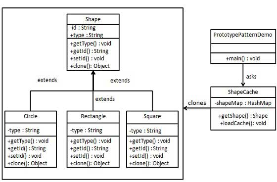

# Prototype Pattern

Prototype pattern is a creational design pattern that allows us to create objects based on existing objects through cloning. This pattern is useful when we need to create a large number of similar objects that differ only in their state or when creating objects is expensive or time-consuming. The prototype pattern avoids the need for subclassing by cloning a prototype object and then customizing it.

In the Prototype pattern, we define an interface or abstract class that describes the methods that need to be implemented to clone an object. The concrete implementation of the prototype object implements these methods to create a copy of the object.

## Implementation -
1. Java & Spring boot have same implementation -
    1. Create an abstract class implementing Clonable interface.
    2. Create concrete classes extending the above abstract class.
    3. Create a class to get concrete classes from database and store them in a Hashtable.
    4. PrototypePatternDemo uses ShapeCache class to get clones of shapes stored in a Hashtable.