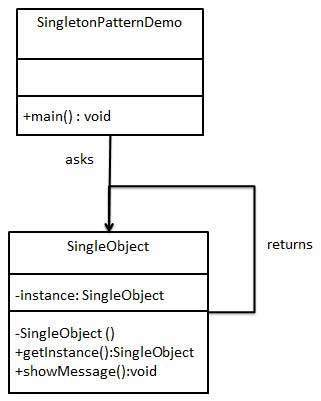

# Singleton Pattern

The Singleton Pattern is a design pattern that restricts the instantiation of a class to a single instance and provides a global point of access to that instance. This pattern is commonly used in situations where a single instance of a class is required to coordinate actions across a system.

It is one of the simplest design patterns in Java. This type of design pattern comes under creational pattern as this pattern provides one of the best ways to create an object. This pattern involves a single class which is responsible to create an object while making sure that only single object gets created. This class provides a way to access its only object which can be accessed directly without need to instantiate the object of the class.



## Implementation -
1. Java -
   1. Declare a private static variable to hold the single instance of the class.
   2. Declare a private constructor to prevent the creation of additional instances.
   3. Define a public static method that returns the single instance of the class, creating it if necessary.

```java
public class Singleton {
    // Step 1: Declare a private static variable to hold the single instance of the class.
    private static Singleton instance;

    // Step 2: Declare a private constructor to prevent the creation of additional instances.
    private Singleton() {}

    // Step 3: Define a public static method that returns the single instance of the class, creating it if necessary.
    public static Singleton getInstance() {
        if (instance == null) {
            instance = new Singleton();
        }
        return instance;
    }
}
```

In this implementation, the Singleton class has a private static variable instance that holds the single instance of the class. The constructor of the class is declared as private to prevent the creation of additional instances from outside the class.

The public static method getInstance() is defined to return the single instance of the class, creating it if necessary. The method first checks if the instance variable is null. If it is, a new instance of the class is created and assigned to the instance variable. If it is not null, the existing instance is returned.

Here's an example usage of the Singleton class:
```java
public class Main {
    public static void main(String[] args) {
        Singleton singleton1 = Singleton.getInstance();
        Singleton singleton2 = Singleton.getInstance();

        // The two objects should be the same instance
        System.out.println(singleton1 == singleton2); // Output: true
    }
}
```

In this example, two instances of the Singleton class are obtained using the getInstance() method. Since the getInstance() method always returns the same instance, the two objects are the same instance and the output is true.

Overall, the Singleton Pattern provides a simple way to ensure that a class has only one instance and provides a global point of access to that instance.

2. Spring Boot - In Spring Boot, we can use the @Component annotation to mark a class as a singleton, and then use dependency injection to obtain a reference to that singleton instance.